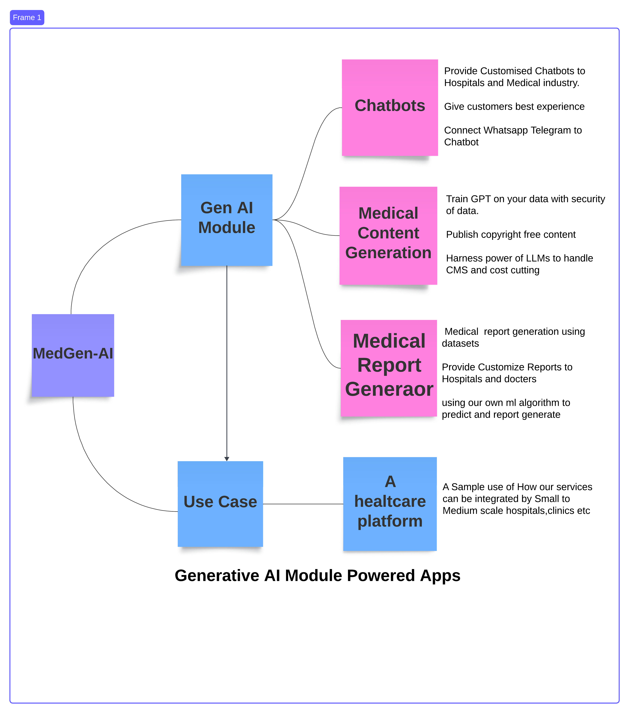

# MedGen AI! 

## MedGen AI - Empowering Medical Professionals through Generative AI

### [Visit Deployed Site Here](https://its.teamcode.tech/)  
**UserID:** user@gmail.com  
**Password:** user@gmail.com  
**AdminID:** admin@gmail.com  
**Password:** admin@gmail.com

---

## Problem it Solves
- Symptom checker with 2d Avatar and conversation
- Query with MEdical documents and make it faster
- Essential summaries and assistance through Generative AI Chatbots.
- Efficient medical education planning and curriculum preparation with detailed nuances.
- Empowering publishing and creator space for medical content generation for blogs, videos with copyright-free assets.

### AI Features of MedGen AI

- Summarization, PDF chat with Langchain, Curated guides from Generative AI.
- Create templates and generate content from fine-tuned LLMs for specific medical domains.
- Transcript generation for medical videos with maximum accuracy.
- Speech Synthesis with human tones.
- Royalty-free high-quality image generation with positive and negative prompting.
- User profile creation with subscription plans.

### Basic Features

- Book appointments, access medical resources, and explore various healthcare services.
- Explore various categories of medical facilities and healthcare professionals.
- Search and get curated results based on ratings, price aggregators.
- Apply various filters to get the desired medical services.

---

### PoC UI - MedGen AI Web App

---

## Technology Used

- React, JavaScript
- HTML, CSS, Bootstrap
- PHP, Laravel Blade
- MySQL, Firebase
- Azure Voice, Whisper
- SST TTS, GCP
- Gradio LLM Llama 7B
- Stable Diffusion DALL-E
- Hugging Face API

---

## Challenges We Faced

- Engaging UI design for MedGen AI.
- Integration of fine-tuned custom LLM models.
- Prompt engineering to control responses.
- Integrating multimodal features into one platform.
- Database design to handle all medical assets.
- Providing enterprise features for shared workspace.
- Gathering data for medical categories like hospitals, clinics, specialties, etc.
- Building a database for coordinates (latitude and longitude) of medical facilities.
- Fetching medical reviews and ratings.
- Planning searching parameters.
- Integrating multiple 3rd-party services like maps, booking sites.

---

## Proposed Enhancements

- Create a pipeline between vendors and MedGen AI.
- Integrate appointment booking features.
- Implement live in-app medical events.
- Support for connecting chains of healthcare institutions.

---

## Installation of Project

### Prerequisites

- PHP v8.1, PHP Mbstring Extension, PHP PDO Extension, PHP FileInfo Extension, PHP JSON Extension, PHP CURL Extension, PHP ZipArchive Extension, PHP symlink() function, PHP shell_exec() function, PHP file_get_contents() function.

### Setup

- Set up Wamp or Xampp Server for Windows, LAMP Server for Linux, or MAMP for Mac.
- Zip and upload the contents of the GitHub project to the root directory of your hosting server.
- Create a MySQL database and a user for access.
- Open .env.example, add necessary details, and rename it to .env.
- Import .sql content into phpMyAdmin.

Boom! Now you can access your MedGen AI with credentials user@gmail.com and user@gmail.com.

---

### Contributors

- Aman Gupta
- Shashank Kumar
- Prarthana Agrawal

Built with ❤️ by Team C.O.D.E at Code-O-Fiesta 2.0 | ITS Engineering College
